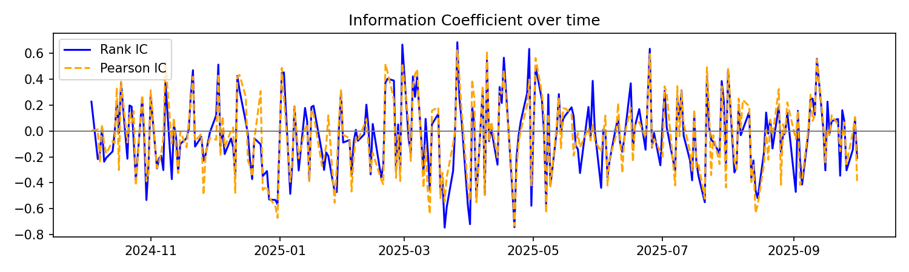
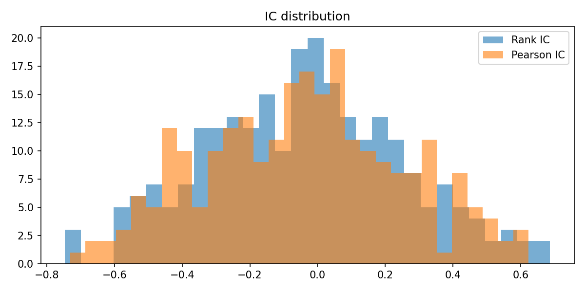
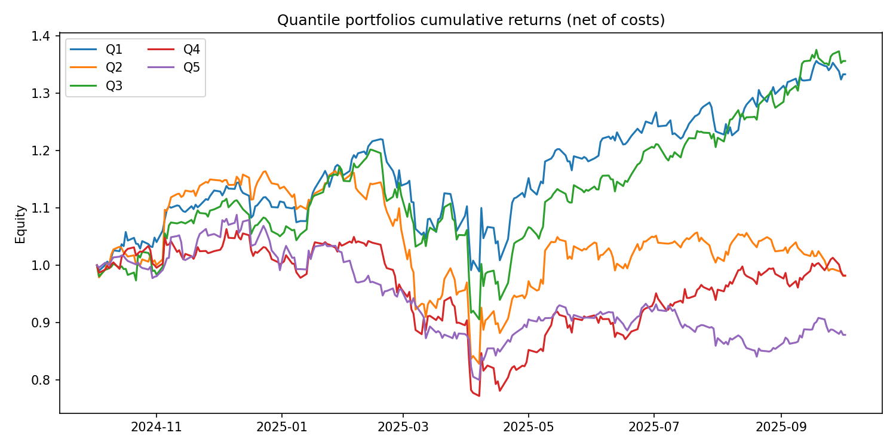
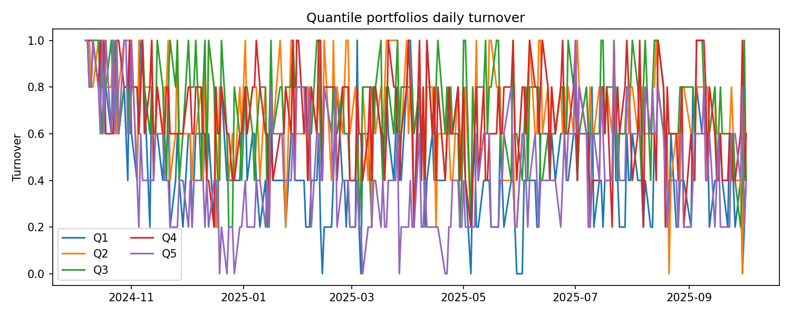

# 📚 量化交易系统初学者使用指南

> 🎯 **目标读者**: 量化交易初学者、Python编程爱好者、金融数据分析学习者
> 
> 📖 **学习时长**: 约2-3小时
> 
> 🛠️ **前置知识**: 基础Python语法、简单的金融概念

## 📋 目录

### 🚀 [第一章：快速开始](#第一章快速开始)
- [1.1 环境安装与配置](#11-环境安装与配置)
- [1.2 项目结构介绍](#12-项目结构介绍)
- [1.3 运行第一个示例](#13-运行第一个示例)

### 📊 [第二章：数据管理](#第二章数据管理)
- [2.1 数据获取原理](#21-数据获取原理)
- [2.2 缓存机制详解](#22-缓存机制详解)
- [2.3 实战：获取股票数据](#23-实战获取股票数据)

### 🔍 [第三章：因子计算与评估](#第三章因子计算与评估)
- [3.1 什么是量化因子](#31-什么是量化因子)
- [3.2 技术指标因子](#32-技术指标因子)
- [3.3 因子评估指标](#33-因子评估指标)
- [3.4 实战：完整因子分析](#34-实战完整因子分析)

### 📈 [第四章：图表解读](#第四章图表解读)
- [4.1 IC时间序列图](#41-ic时间序列图)
- [4.2 IC分布直方图](#42-ic分布直方图)
- [4.3 分位数组合收益](#43-分位数组合收益)
- [4.4 多空组合净值曲线](#44-多空组合净值曲线)
- [4.5 换手率分析](#45-换手率分析)

### 🛠️ [第五章：常见问题与解决方案](#第五章常见问题与解决方案)
- [5.1 环境配置问题](#51-环境配置问题)
- [5.2 数据获取问题](#52-数据获取问题)
- [5.3 计算结果异常](#53-计算结果异常)

### 🎓 [第六章：进阶技巧](#第六章进阶技巧)
- [6.1 自定义因子开发](#61-自定义因子开发)
- [6.2 性能优化技巧](#62-性能优化技巧)
- [6.3 最佳实践建议](#63-最佳实践建议)

---

## 第一章：快速开始

### 1.1 环境安装与配置

#### 🔧 系统要求
- **操作系统**: macOS, Linux, Windows
- **Python版本**: 3.8+
- **内存**: 建议4GB以上
- **磁盘空间**: 至少1GB可用空间

#### 📦 安装步骤

1. **克隆项目**
```bash
git clone https://github.com/your-repo/my-quant.git
cd my-quant
```

2. **创建虚拟环境**
```bash
python -m venv venv
source venv/bin/activate  # macOS/Linux
# 或
venv\Scripts\activate     # Windows
```

3. **安装依赖**
```bash
pip install -r requirements.txt
```

4. **验证安装**
```bash
python test_environment.py
```

✅ **成功标志**: 看到 "Environment setup successful!" 消息

### 1.1.1 快速体验演示

运行快速开始演示脚本，体验系统的核心功能：

```bash
python examples/quick_start_demo.py
```

这个演示将带您体验：
- 📊 数据获取和缓存机制
- 🧮 技术因子计算
- 📈 因子评估和分析  
- 📋 可视化图表生成
- 🎯 结果解读和分析

**演示特点**：
- ⏱️ 整个过程约3-5分钟
- 🎓 适合初学者，有详细说明
- 🔍 实时显示计算过程和结果
- 📊 自动生成可视化图表
- 💡 提供个性化的分析建议

**演示内容预览**：
```
🚀 量化交易系统快速开始演示
=====================================

📍 步骤 1: 初始化系统组件
✅ 数据引擎初始化完成
✅ 技术因子计算器初始化完成  
✅ 因子评估器初始化完成

📍 步骤 2: 数据获取和缓存演示
ℹ️  正在获取股票数据: AAPL, GOOGL, MSFT
✅ 数据获取完成，耗时: 2.34秒
ℹ️  缓存加速比: 12.5x

📍 步骤 3: 技术因子计算演示
✅ 动量因子计算完成
✅ RSI因子计算完成
✅ 波动率因子计算完成

📍 步骤 4: 因子评估和分析演示  
📊 因子评估结果:
  IC均值: 0.0234
  IC_IR: 0.456
  胜率: 54.2%

📍 步骤 5: 可视化图表生成演示
✅ 图表生成完成！
📊 生成了 5 个可视化图表

📍 步骤 6: 结果分析和下一步建议
🎯 因子质量评估和个性化建议
```

### 1.2 项目结构介绍

```
my-quant/
├── 📁 src/                    # 核心源代码
│   ├── 📁 factors/           # 因子计算模块
│   ├── 📁 performance/       # 性能分析模块
│   ├── 📁 backtest/          # 回测引擎
│   └── 📁 strategies/        # 策略模板
├── 📁 examples/              # 示例和教程
├── 📁 data_cache/           # 数据缓存目录
├── 📁 tests/                # 单元测试
├── 📁 docs/                 # 文档目录
└── 📄 requirements.txt      # 依赖列表
```

### 1.3 运行第一个示例

让我们运行一个简单的示例来体验系统功能：

```bash
cd examples
python mvp_demo.py
```

🎉 **期望结果**: 
- 自动下载股票数据
- 计算技术指标
- 生成性能图表
- 输出分析结果

---

## 第二章：数据管理

### 2.1 数据获取原理

我们的系统使用 **yfinance** 库从Yahoo Finance获取股票数据：

```python
import yfinance as yf

# 获取苹果公司股票数据
ticker = yf.Ticker("AAPL")
data = ticker.history(period="1y")
print(data.head())
```

**数据包含字段**:
- `Open`: 开盘价
- `High`: 最高价  
- `Low`: 最低价
- `Close`: 收盘价
- `Volume`: 成交量

### 2.2 缓存机制详解

#### 🗄️ 为什么需要缓存？
- **提高速度**: 避免重复下载
- **节省带宽**: 减少网络请求
- **离线使用**: 支持无网络环境

#### 📁 缓存文件格式
```
data_cache/ohlcv_AAPL_2024-01-01_2024-12-31_1d.meta
```

**文件名解析**:
- `ohlcv`: 数据类型
- `AAPL`: 股票代码
- `2024-01-01_2024-12-31`: 时间范围
- `1d`: 数据频率（日线）
- `.meta`: 缓存格式

### 2.3 实战：获取股票数据

创建一个简单的数据获取脚本：

```python
# data_example.py
from src.factors.engine import FactorEngine

# 初始化因子引擎
engine = FactorEngine()

# 获取多只股票数据
symbols = ['AAPL', 'GOOGL', 'MSFT', 'TSLA']
data = engine.get_data(symbols, period='6m')

print(f"获取了 {len(symbols)} 只股票的数据")
print(f"数据形状: {data.shape}")
print(f"时间范围: {data.index[0]} 到 {data.index[-1]}")
```

---

## 第三章：因子计算与评估

### 3.1 什么是量化因子

**量化因子** 是用来预测股票未来收益的数值指标。

#### 🎯 因子的作用
- **选股**: 找出可能上涨的股票
- **择时**: 判断买入卖出时机
- **风险控制**: 评估投资风险

#### 📊 因子分类
1. **技术因子**: 基于价格和成交量
   - RSI（相对强弱指数）
   - MACD（移动平均收敛散度）
   - 布林带

2. **基本面因子**: 基于财务数据
   - PE比率
   - ROE（净资产收益率）
   - 营收增长率

### 3.2 技术指标因子

#### 📈 RSI指标详解

**RSI（Relative Strength Index）** 衡量股票的超买超卖状态：

```python
from src.factors.technical import TechnicalFactors

# 创建技术因子计算器
tech_factors = TechnicalFactors()

# 计算RSI
rsi = tech_factors.rsi(data['Close'], window=14)

# RSI解读
# RSI > 70: 超买，可能下跌
# RSI < 30: 超卖，可能上涨
# 30 <= RSI <= 70: 正常区间
```

### 3.3 因子评估指标

#### 🔍 IC（Information Coefficient）

**IC** 衡量因子预测能力的核心指标：

```python
# IC计算原理
correlation = factor_scores.corrwith(future_returns)
ic_mean = correlation.mean()  # IC均值
ic_std = correlation.std()    # IC标准差
ic_ir = ic_mean / ic_std      # 信息比率
```

**IC指标解读**:
- `IC均值 > 0.05`: 因子有效
- `IC均值 < -0.05`: 反向有效
- `|IC均值| < 0.02`: 因子无效
- `IC_IR > 0.5`: 因子稳定性好

### 3.4 实战：完整因子分析

运行完整的因子评估：

```bash
python examples/factor_evaluation.py
```

**输出文件**:
- `factor_eval_ic_ts.png`: IC时间序列
- `factor_eval_ic_hist.png`: IC分布
- `factor_eval_quantiles.png`: 分位数收益
- `factor_eval_longshort_equity.png`: 多空净值
- `factor_eval_turnover.png`: 换手率

---

## 第四章：图表解读

### 4.1 IC时间序列图



**图表解读**:
- **蓝线**: Rank IC（排序相关性）
- **橙线**: Pearson IC（线性相关性）
- **波动性**: IC稳定性指标
- **趋势**: 因子长期有效性

### 4.2 IC分布直方图



**关键观察点**:
- **分布中心**: 接近0说明因子无效
- **分布宽度**: 越窄越稳定
- **偏度**: 正偏说明正向预测能力强

### 4.3 分位数组合收益



**分析要点**:
- **Q5（最高分位）**: 因子值最高的股票组合
- **Q1（最低分位）**: 因子值最低的股票组合
- **单调性**: Q5 > Q4 > Q3 > Q2 > Q1 说明因子有效

### 4.4 多空组合净值曲线


**策略逻辑**:
- **做多**: 因子值最高的股票（Q5）
- **做空**: 因子值最低的股票（Q1）
- **净值上升**: 策略盈利
- **最大回撤**: 风险控制指标

### 4.5 换手率分析



**成本考虑**:
- **换手率**: 每期调仓比例
- **交易成本**: 换手率 × 手续费率
- **净收益**: 总收益 - 交易成本

---

## 第五章：常见问题与解决方案

### 5.1 环境配置问题

#### ❌ 问题：pip安装失败
```bash
ERROR: Could not install packages due to an EnvironmentError
```

✅ **解决方案**:
```bash
# 升级pip
python -m pip install --upgrade pip

# 使用国内镜像
pip install -r requirements.txt -i https://pypi.tuna.tsinghua.edu.cn/simple/
```

#### ❌ 问题：Python版本不兼容
```bash
SyntaxError: invalid syntax
```

✅ **解决方案**:
```bash
# 检查Python版本
python --version

# 需要Python 3.12（强制要求），建议使用pyenv管理版本
pyenv install 3.9.0
pyenv local 3.9.0
```

### 5.2 数据获取问题

#### ❌ 问题：网络连接超时
```bash
ConnectionError: HTTPSConnectionPool
```

✅ **解决方案**:
1. **检查网络连接**
2. **使用代理**（如需要）
3. **增加重试次数**

#### ❌ 问题：股票代码无效
```bash
No data found, symbol may be delisted
```

✅ **解决方案**:
- 确认股票代码正确
- 检查股票是否退市
- 使用有效的时间范围

### 5.3 计算结果异常

#### ❌ 问题：IC值全为NaN
```bash
IC Mean: nan, IC IR: nan
```

✅ **解决方案**:
1. **检查数据完整性**
2. **确保有足够的历史数据**
3. **验证因子计算逻辑**

---

## 第六章：进阶技巧

### 6.1 自定义因子开发

创建自己的因子：

```python
# custom_factor.py
import pandas as pd
import numpy as np

class CustomFactor:
    def momentum_factor(self, data, window=20):
        """
        动量因子：过去N天的累计收益率
        """
        returns = data['Close'].pct_change()
        momentum = returns.rolling(window=window).sum()
        return momentum
    
    def volatility_factor(self, data, window=20):
        """
        波动率因子：过去N天收益率的标准差
        """
        returns = data['Close'].pct_change()
        volatility = returns.rolling(window=window).std()
        return volatility
```

### 6.2 性能优化技巧

#### 🚀 数据处理优化
```python
# 使用向量化操作
data['returns'] = data['Close'].pct_change()

# 避免循环，使用pandas内置函数
data['sma'] = data['Close'].rolling(20).mean()

# 批量处理多只股票
def batch_process(symbols):
    results = {}
    for symbol in symbols:
        results[symbol] = process_single_stock(symbol)
    return results
```

#### 💾 内存管理
```python
# 及时释放不需要的数据
del large_dataframe

# 使用适当的数据类型
data['volume'] = data['volume'].astype('int32')

# 分批处理大数据集
chunk_size = 100
for chunk in pd.read_csv('large_file.csv', chunksize=chunk_size):
    process_chunk(chunk)
```

### 6.3 最佳实践建议

#### 📋 开发流程
1. **数据探索** → 了解数据特征
2. **因子设计** → 基于金融逻辑
3. **回测验证** → 历史数据测试
4. **参数优化** → 调整因子参数
5. **风险控制** → 添加止损机制

#### 🎯 注意事项
- **避免过拟合**: 不要过度优化历史数据
- **考虑交易成本**: 包含手续费和冲击成本
- **定期更新**: 因子效果会衰减
- **组合管理**: 多因子组合降低风险

---

## 🎉 恭喜完成学习！

您已经掌握了量化交易系统的基本使用方法。现在可以：

1. **🔍 探索更多因子**: 尝试不同的技术指标
2. **📊 分析结果**: 深入理解图表含义  
3. **🚀 开发策略**: 基于因子构建交易策略
4. **📈 持续学习**: 关注量化投资最新发展

### 📚 推荐学习资源

#### 📊 图文并茂指南
- **[📸 可视化使用指南](VISUAL_GUIDE.md)** - 通过丰富的图表和截图学习系统使用
  - 界面截图说明
  - 图表解读示例  
  - 操作流程图
  - 实战案例展示

#### 📖 深入学习
- [量化投资基础知识](./QUANT_BASICS.md)
- [Python金融数据分析](./PYTHON_FINANCE.md)
- [因子投资进阶](./FACTOR_ADVANCED.md)

#### 📊 实践项目
- 构建自己的因子库
- 开发量化交易策略
- 参与开源项目贡献

### 💬 获得帮助
- 📧 邮件支持: support@example.com
- 💬 社区讨论: [GitHub Issues](https://github.com/your-repo/issues)
- 📖 文档更新: [项目Wiki](https://github.com/your-repo/wiki)

---

*最后更新: 2025年1月* | *版本: v1.2.0*