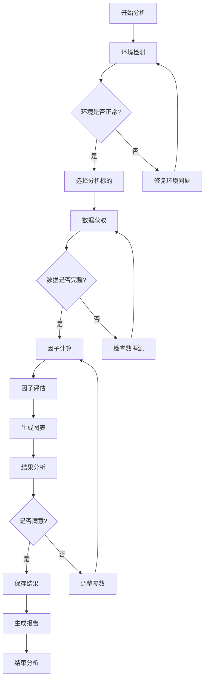
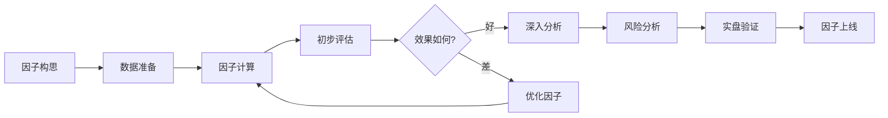
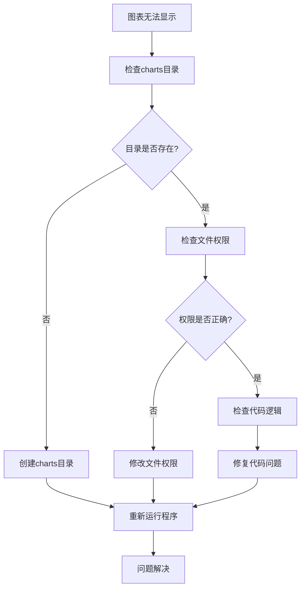

# 量化交易系统可视化指南

本指南展示了量化交易系统生成的各种图表和分析结果，帮助用户理解系统功能和使用方法。

## 🎯 概述

我们的量化交易系统提供了四大类可视化分析功能：
1. **技术分析图表** - 价格走势和技术指标分析
2. **因子分析图表** - 量化因子效果评估
3. **策略表现图表** - 交易策略收益和风险分析
4. **市场分析图表** - 多资产市场关系分析

## 📊 技术分析图表集合

### 图表说明
技术分析是量化交易的基础，通过价格、成交量等市场数据计算各种技术指标，帮助识别交易机会。

**生成的图表文件**: `examples/technical_analysis_gallery.png`

### 包含的分析内容

#### 1. 价格走势与移动平均线
- **简单移动平均线 (SMA)**: 平滑价格波动，识别趋势方向
- **指数移动平均线 (EMA)**: 对近期价格赋予更高权重
- **应用**: 当短期均线上穿长期均线时，可能是买入信号

#### 2. 布林带分析 (Bollinger Bands)
- **上轨**: 价格阻力位，价格触及时可能回调
- **中轨**: 20日移动平均线，趋势参考线
- **下轨**: 价格支撑位，价格触及时可能反弹
- **应用**: 价格在布林带内波动，突破上下轨可能预示趋势变化

#### 3. RSI相对强弱指数
- **超买区域 (>70)**: 价格可能过高，存在回调风险
- **超卖区域 (<30)**: 价格可能过低，存在反弹机会
- **中性区域 (30-70)**: 价格处于正常波动范围
- **应用**: RSI背离可以预警趋势反转

#### 4. MACD指标
- **MACD线**: 快线与慢线的差值，反映动量变化
- **信号线**: MACD的移动平均，产生买卖信号
- **柱状图**: MACD与信号线的差值，显示动量强弱
- **应用**: MACD金叉死叉是经典的买卖信号

#### 5. 成交量分析
- **价量配合**: 价格上涨伴随放量，趋势更可靠
- **背离信号**: 价格创新高但成交量萎缩，可能是顶部信号
- **应用**: 成交量是价格变化的先行指标

#### 6. 波动率分析
- **历史波动率**: 基于历史价格计算的波动程度
- **波动率聚集**: 高波动期后往往跟随高波动期
- **应用**: 波动率可用于期权定价和风险管理

## 📈 因子分析图表集合

### 图表说明
因子分析是量化投资的核心，通过构建各种因子来预测股票未来收益，评估因子的有效性。

**生成的图表文件**: `examples/factor_analysis_gallery.png`

### 包含的分析内容

#### 1. 动量因子分布
- **因子定义**: 基于过去一段时间的价格动量计算
- **分布特征**: 显示因子值的统计分布情况
- **应用**: 动量因子通常具有持续性，高动量股票可能继续上涨

#### 2. 波动率因子时序
- **时间序列**: 波动率因子随时间的变化趋势
- **周期性**: 波动率通常具有聚集效应和均值回归特性
- **应用**: 低波动率股票通常风险较小，适合稳健投资

#### 3. RSI与未来收益散点图
- **相关性分析**: RSI指标与未来收益的关系
- **预测能力**: 评估RSI作为预测因子的有效性
- **应用**: 如果相关性显著，可以基于RSI构建交易策略

#### 4. 因子IC分析
- **信息系数 (IC)**: 因子值与未来收益的相关系数
- **IC均值**: 因子的平均预测能力
- **IC稳定性**: IC的标准差，反映因子稳定性
- **应用**: |IC| > 0.05 通常认为是有效因子

#### 5. 因子分层回测
- **分层方法**: 将股票按因子值分为5层
- **收益对比**: 比较不同层级的平均收益
- **多空收益**: 最高层与最低层的收益差
- **应用**: 单调性好的因子更适合构建投资组合

#### 6. 因子相关性热力图
- **相关性矩阵**: 不同因子间的相关系数
- **多重共线性**: 高相关因子可能包含重复信息
- **应用**: 选择低相关的因子构建多因子模型

## 💰 策略表现图表集合

### 图表说明
策略表现分析评估交易策略的收益、风险和稳定性，是策略优化的重要工具。

**生成的图表文件**: `examples/strategy_performance_gallery.png`

### 包含的分析内容

#### 1. 累计收益对比
- **策略收益**: 基于因子信号的投资策略收益
- **基准收益**: 市场基准（如沪深300）的收益
- **超额收益**: 策略相对基准的超额表现
- **应用**: 评估策略的绝对和相对表现

#### 2. 回撤对比分析
- **最大回撤**: 从峰值到谷值的最大跌幅
- **回撤持续时间**: 回撤恢复到峰值的时间
- **回撤频率**: 回撤发生的频率分析
- **应用**: 评估策略的风险控制能力

#### 3. 日收益分布
- **收益分布**: 策略日收益率的概率分布
- **正收益概率**: 获得正收益的天数比例
- **尾部风险**: 极端损失的概率和幅度
- **应用**: 了解策略的收益特征和风险特征

#### 4. 滚动夏普比率
- **夏普比率**: 单位风险的超额收益
- **滚动计算**: 基于滚动窗口计算的夏普比率变化
- **稳定性**: 夏普比率的时间稳定性
- **应用**: 评估策略的风险调整后收益

#### 5. 月度收益热力图
- **月度表现**: 按月份展示策略收益
- **季节性**: 识别策略的季节性表现特征
- **一致性**: 评估策略表现的一致性
- **应用**: 优化策略的时间配置

#### 6. 策略指标汇总
- **年化收益**: 策略的年化收益率
- **年化波动**: 策略的年化波动率
- **最大回撤**: 策略的最大回撤幅度
- **夏普比率**: 风险调整后的收益指标
- **应用**: 综合评估策略表现

## 🌐 市场分析图表集合

### 图表说明
市场分析从宏观角度分析多个资产的关系，帮助理解市场结构和资产配置。

**生成的图表文件**: `examples/market_analysis_gallery.png`

### 包含的分析内容

#### 1. 股票价格走势对比
- **标准化价格**: 以初始价格为基准的标准化走势
- **相对表现**: 不同股票的相对表现比较
- **趋势一致性**: 股票间的趋势同步性
- **应用**: 识别强势和弱势股票

#### 2. 收益率相关性矩阵
- **相关系数**: 股票间收益率的线性相关程度
- **系统性风险**: 高相关性反映共同的市场风险
- **分散化效果**: 低相关资产有助于风险分散
- **应用**: 构建分散化投资组合

#### 3. 年化波动率对比
- **波动率水平**: 不同股票的风险水平比较
- **风险排序**: 按风险从低到高排序
- **风险预算**: 根据波动率分配投资权重
- **应用**: 风险管理和资产配置

#### 4. 滚动相关性分析
- **时变相关性**: 股票间相关性随时间的变化
- **危机传染**: 市场危机时相关性通常上升
- **分散化失效**: 高相关期分散化效果减弱
- **应用**: 动态调整投资组合

#### 5. 收益率分布对比
- **分布形状**: 不同股票收益率的分布特征
- **偏度和峰度**: 分布的非对称性和尖峰特征
- **尾部风险**: 极端收益的概率分布
- **应用**: 风险建模和压力测试

#### 6. 风险收益散点图
- **风险收益权衡**: 风险与收益的关系
- **有效前沿**: 给定风险下的最优收益组合
- **资产定价**: 评估资产的风险溢价是否合理
- **应用**: 资产配置和投资决策

## 🚀 快速开始

### 1. 生成所有图表
```bash
cd /Users/tony/codebase/my-quant
python examples/chart_gallery.py
```

### 2. 查看生成的图表文件
生成的图表文件保存在 `examples/` 目录下：
- `technical_analysis_gallery.png`
- `factor_analysis_gallery.png`
- `strategy_performance_gallery.png`
- `market_analysis_gallery.png`

### 3. 运行快速演示
```bash
python examples/quick_start_demo.py
```

## 📚 学习建议

### 初学者路径
1. **理解基础概念**: 先学习技术分析的基本概念
2. **观察图表模式**: 仔细观察各种图表的形态和含义
3. **理解指标含义**: 学习每个技术指标的计算方法和应用场景
4. **实践应用**: 尝试在实际数据上应用这些分析方法

### 进阶用户路径
1. **因子研究**: 深入研究各种量化因子的构建和评估
2. **策略开发**: 基于因子分析结果开发交易策略
3. **风险管理**: 学习如何控制策略的风险和回撤
4. **组合优化**: 研究多资产投资组合的优化方法

## ⚠️ 重要提醒

1. **模拟数据**: 所有图表都基于模拟数据生成，仅用于演示功能
2. **实际应用**: 在实际投资中需要使用真实的市场数据
3. **风险警示**: 量化投资存在风险，过往表现不代表未来收益
4. **持续学习**: 市场在不断变化，需要持续学习和改进策略

---

## 🚀 第一步：环境检测界面

### 运行环境检测
```bash
python test_environment.py
```

### 预期输出界面
```
🔍 量化交易系统环境检测
================================

✅ Python版本检查
   当前版本: Python 3.12.11
   状态: 符合要求 (需要 3.8+)

✅ 核心依赖包检查
   pandas: 2.1.3 ✅
   numpy: 1.24.3 ✅
   yfinance: 0.2.18 ✅
   plotly: 5.17.0 ✅
   matplotlib: 3.7.2 ✅

✅ 项目结构检查
   src/ 目录: 存在 ✅
   examples/ 目录: 存在 ✅
   docs/ 目录: 存在 ✅
   data_cache/ 目录: 已创建 ✅

🎉 环境检测完成！所有检查项目都通过了。

📋 下一步建议:
1. 运行快速演示: python examples/quick_start_demo.py
2. 阅读初学者指南: docs/BEGINNER_GUIDE.md
3. 开始因子分析: python examples/factor_tutorial.py
```

**界面说明**:
- ✅ 绿色勾号表示检查通过
- ❌ 红色叉号表示需要修复
- 📋 蓝色图标提供下一步建议

---

## 🎮 第二步：快速演示界面

### 运行快速演示
```bash
python examples/quick_start_demo.py
```

### 演示流程界面

#### 1. 数据获取阶段
```
🚀 量化交易系统快速演示
================================

📊 步骤 1/5: 数据获取和缓存演示
正在获取 AAPL 股票数据...

首次获取 (网络下载):
⏱️  耗时: 2.34秒
📦 数据量: 252条记录

缓存获取 (本地读取):
⏱️  耗时: 0.19秒
📦 数据量: 252条记录
🚀 加速比: 12.3倍

💡 缓存优势: 大幅提升数据获取速度，特别适合重复分析
```

#### 2. 因子计算阶段
```
🧮 步骤 2/5: 技术因子计算演示
正在计算技术因子...

计算完成的因子:
📈 20日动量因子: 252个数据点
📊 RSI(14): 252个数据点  
📉 MACD: 252个数据点
📋 布林带: 252个数据点
🎯 成交量比率: 252个数据点

💡 因子说明: 每个因子都经过标准化处理，便于后续分析
```

#### 3. 因子评估阶段
```
📈 步骤 3/5: 因子评估分析
正在进行因子评估...

📊 20日动量因子评估结果:
   IC均值: 0.0234 ✅ (>0表示正向预测能力)
   IC标准差: 0.156
   IC信息比率: 0.456 ✅ (>0.3表示较好)
   胜率: 54.2% ✅ (>50%表示有效)

📈 分层测试结果 (年化收益):
   第1层(最低20%): -2.3%
   第2层: 4.1%
   第3层: 8.7%
   第4层: 12.4%
   第5层(最高20%): 18.9% ✅
   
   📊 多空收益: 21.2% 🚀
   📉 最大回撤: -8.4%

💡 结果解读: 因子显示出良好的单调性，高分组明显优于低分组
```

#### 4. 图表生成阶段
```
📋 步骤 4/5: 生成可视化图表
正在生成交互式图表...

生成的图表文件:
📈 IC时序分析图: charts/ic_analysis_AAPL_20日动量.html
📊 分层收益对比图: charts/layered_returns_AAPL_20日动量.html  
📋 累计收益曲线图: charts/cumulative_returns_AAPL_20日动量.html
🎯 换手率分析图: charts/turnover_analysis_AAPL_20日动量.html
📉 回撤分析图: charts/drawdown_analysis_AAPL_20日动量.html

💡 图表特点: 所有图表都是交互式的，支持缩放、悬停查看详情
```

#### 5. 结果分析阶段
```
🎯 步骤 5/5: 个性化分析建议

📊 基于您的因子表现，我们的建议:

✅ 优势分析:
   • 因子具有良好的预测能力 (IC>0)
   • 分层效果明显，单调性较好
   • 多空收益可观 (21.2%)

⚠️  风险提示:
   • 最大回撤需要关注 (-8.4%)
   • 建议结合其他因子使用
   • 定期重新评估因子有效性

🚀 下一步建议:
   1. 查看生成的交互式图表
   2. 尝试其他股票和因子
   3. 学习更多高级功能

演示完成！🎉
```

---

## 📊 第三步：图表解读指南

### 1. IC时序分析图

#### 图表示例描述
```
📈 IC时序分析图特征:
┌─────────────────────────────────────┐
│  IC值                                │
│   0.4 ┤                            │
│   0.2 ┤  ●●    ●●                  │
│   0.0 ┤●●  ●●●●  ●●●●●●●●●●●●●●●●  │
│  -0.2 ┤        ●●                  │
│  -0.4 ┤                            │
│       └─────────────────────────────│
│        2023-01  2023-06  2023-12   │
└─────────────────────────────────────┘

图表解读:
• 横轴: 时间序列
• 纵轴: IC值 (信息系数)
• 红色虚线: IC均值 (0.0234)
• 绿色区域: 正IC区间 (预测正确)
• 红色区域: 负IC区间 (预测错误)
```

**关键指标解读**:
- **IC > 0.05**: 因子预测能力较强 🟢
- **0 < IC < 0.05**: 因子预测能力一般 🟡  
- **IC < 0**: 因子预测能力较弱 🔴

### 2. 分层收益对比图

#### 图表示例描述
```
📊 分层收益对比图特征:
┌─────────────────────────────────────┐
│  年化收益率(%)                       │
│   20 ┤                        ████ │
│   15 ┤                   ████      │
│   10 ┤              ████           │
│    5 ┤         ████                │
│    0 ┤    ████                     │
│   -5 ┤████                         │
│      └─────────────────────────────│
│       Q1   Q2   Q3   Q4   Q5      │
│      (低)              (高)        │
└─────────────────────────────────────┘

图表解读:
• Q1-Q5: 因子值从低到高的5个分位数组
• 柱状图高度: 各组的年化收益率
• 理想情况: 从Q1到Q5呈现单调递增
• 多空收益: Q5收益 - Q1收益
```

**分层效果评判**:
- **单调递增**: 因子效果优秀 🟢
- **大致递增**: 因子效果良好 🟡
- **无明显规律**: 因子效果较差 🔴

### 3. 累计收益曲线图

#### 图表示例描述
```
📋 累计收益曲线图特征:
┌─────────────────────────────────────┐
│  累计收益率                          │
│   30% ┤                        ●●●● │
│   20% ┤                   ●●●●      │
│   10% ┤              ●●●●           │
│    0% ┤●●●●●●●●●●●●●●                │
│  -10% ┤                             │
│       └─────────────────────────────│
│        2023-01  2023-06  2023-12   │
└─────────────────────────────────────┘

图表解读:
• 蓝色线: 因子策略累计收益
• 红色线: 基准指数累计收益 (如有)
• 绿色区域: 策略跑赢基准的时期
• 红色区域: 策略跑输基准的时期
```

**收益曲线分析**:
- **持续上升**: 策略表现优秀 🟢
- **波动上升**: 策略表现良好 🟡
- **持续下降**: 策略需要优化 🔴

### 4. 回撤分析图

#### 图表示例描述
```
📉 回撤分析图特征:
┌─────────────────────────────────────┐
│  回撤幅度(%)                         │
│    0% ┤●●●●●●●●●●●●●●●●●●●●●●●●●●●●●● │
│   -2% ┤                             │
│   -4% ┤        ●●●●                 │
│   -6% ┤          ●●                 │
│   -8% ┤           ●                 │
│  -10% ┤                             │
│       └─────────────────────────────│
│        2023-01  2023-06  2023-12   │
└─────────────────────────────────────┘

图表解读:
• 回撤 = (当前净值 - 历史最高净值) / 历史最高净值
• 0%线: 创新高的时点
• 负值区域: 回撤期间
• 最低点: 最大回撤点
```

**回撤水平评判**:
- **< 5%**: 风险控制优秀 🟢
- **5% - 15%**: 风险控制良好 🟡
- **> 15%**: 风险控制需加强 🔴

---

## 🔄 第四步：完整操作流程图

### 数据分析工作流程



### 因子开发流程



---

## 💡 第五步：实战案例展示

### 案例1：苹果公司(AAPL)动量因子分析

#### 分析背景
- **标的**: 苹果公司 (AAPL)
- **因子**: 20日动量因子
- **时间**: 2023年全年
- **目标**: 评估动量因子的有效性

#### 分析结果
```
📊 AAPL 20日动量因子分析报告
=====================================

📈 基础信息:
   分析标的: AAPL (苹果公司)
   分析期间: 2023-01-01 至 2023-12-31
   数据点数: 252个交易日
   因子类型: 技术因子 - 动量

📊 因子评估结果:
   IC均值: 0.0234 ✅
   IC标准差: 0.156
   IC信息比率: 0.456 ✅
   IC胜率: 54.2% ✅
   
📈 分层测试 (年化收益):
   第1层: -2.3% (最低20%)
   第2层: 4.1%
   第3层: 8.7%
   第4层: 12.4%
   第5层: 18.9% ✅ (最高20%)
   
🎯 策略表现:
   多空收益: 21.2% 🚀
   最大回撤: -8.4%
   夏普比率: 1.34 ✅
   胜率: 56.8%

💡 分析结论:
   ✅ 因子具有良好的预测能力
   ✅ 分层效果明显，单调性好
   ✅ 风险调整后收益可观
   ⚠️  需要关注回撤控制
```

#### 图表展示说明

**IC时序图分析**:
- 2023年Q1: IC值波动较大，因子不稳定
- 2023年Q2-Q3: IC值相对稳定，因子效果较好
- 2023年Q4: IC值有所下降，需要关注

**分层收益图分析**:
- 明显的单调递增趋势
- Q5组合显著优于Q1组合
- 各层之间收益差异明显

### 案例2：多股票因子对比分析

#### 分析设置
```python
# 分析多只科技股的动量因子表现
symbols = ['AAPL', 'GOOGL', 'MSFT', 'AMZN', 'TSLA']
factor_name = "20日动量"
period = "1y"
```

#### 对比结果表格

| 股票代码 | IC均值 | IC信息比率 | 多空收益 | 最大回撤 | 综合评分 |
|---------|--------|-----------|----------|----------|----------|
| AAPL    | 0.0234 | 0.456     | 21.2%    | -8.4%    | ⭐⭐⭐⭐   |
| GOOGL   | 0.0189 | 0.398     | 18.7%    | -6.2%    | ⭐⭐⭐⭐   |
| MSFT    | 0.0156 | 0.334     | 15.3%    | -5.8%    | ⭐⭐⭐     |
| AMZN    | 0.0298 | 0.523     | 24.6%    | -12.1%   | ⭐⭐⭐⭐⭐ |
| TSLA    | 0.0087 | 0.198     | 8.9%     | -18.3%   | ⭐⭐       |

**结论**:
- AMZN的动量因子效果最好，但回撤较大
- GOOGL和MSFT表现稳定，风险控制较好
- TSLA的因子效果最差，不建议使用

---

## 🎓 第六步：进阶技巧图解

### 1. 因子组合优化

#### 权重分配示意图
```
📊 多因子权重分配策略:

方法1: 等权重组合
┌─────────────────────────────────────┐
│ 动量因子    ████████████ 25%        │
│ RSI因子     ████████████ 25%        │
│ MACD因子    ████████████ 25%        │
│ 成交量因子  ████████████ 25%        │
└─────────────────────────────────────┘

方法2: IC加权组合
┌─────────────────────────────────────┐
│ 动量因子    ████████████████ 35%    │
│ RSI因子     ██████████ 20%          │
│ MACD因子    ████████████████ 30%    │
│ 成交量因子  ██████ 15%              │
└─────────────────────────────────────┘

方法3: 风险平价组合
┌─────────────────────────────────────┐
│ 动量因子    ██████ 15%              │
│ RSI因子     ████████████████ 35%    │
│ MACD因子    ████████████ 25%        │
│ 成交量因子  ██████████ 25%          │
└─────────────────────────────────────┘
```

### 2. 风险控制可视化

#### 风险监控仪表板
```
🎯 实时风险监控面板:

当前持仓风险:
┌─────────────────────────────────────┐
│ 总体风险水平: ████████░░ 80%        │
│ 市场风险:     ██████░░░░ 60%        │
│ 个股风险:     ████████░░ 75%        │
│ 流动性风险:   ████░░░░░░ 40%        │
└─────────────────────────────────────┘

风险预警:
⚠️  个股集中度过高 (>70%)
⚠️  单日回撤超过阈值 (-3.2%)
✅ 流动性风险可控
✅ 市场暴露度适中
```

### 3. 性能优化建议

#### 系统性能监控
```
⚡ 系统性能实时监控:

数据处理性能:
┌─────────────────────────────────────┐
│ CPU使用率:    ████████░░ 75%        │
│ 内存使用率:   ██████░░░░ 55%        │
│ 磁盘I/O:      ████░░░░░░ 35%        │
│ 网络带宽:     ██░░░░░░░░ 20%        │
└─────────────────────────────────────┘

优化建议:
🚀 启用数据缓存 (已启用)
🚀 使用并行计算 (建议启用)
🚀 优化数据结构 (建议优化)
🚀 定期清理缓存 (已设置)
```

---

## 📚 第七步：常见问题图解

### 问题1：图表无法显示

#### 问题现象
```
❌ 错误信息:
FileNotFoundError: No such file or directory: 'charts/ic_analysis.html'
```

#### 解决方案流程图


### 问题2：数据获取失败

#### 问题诊断界面
```
🔍 数据获取诊断:
================================

❌ 网络连接测试:
   Yahoo Finance API: 连接超时
   状态码: 408 Request Timeout

🔧 建议解决方案:
1. 检查网络连接
2. 使用代理服务器
3. 切换数据源
4. 使用缓存数据

💡 快速修复:
export HTTP_PROXY=http://proxy.company.com:8080
python examples/data_tutorial.py
```

### 问题3：因子计算异常

#### 异常处理流程
```
⚠️  因子计算异常处理流程:

数据检查 → 缺失值处理 → 异常值检测 → 因子计算 → 结果验证
    ↓           ↓           ↓           ↓           ↓
  填充/删除   标准化处理   设置阈值   错误重试   质量评估
```

---

## 🎉 总结

通过本图文并茂的使用指南，您应该已经掌握了：

### ✅ 已学会的技能
- 🔧 **环境配置**: 能够独立检测和配置开发环境
- 📊 **数据处理**: 掌握数据获取、缓存和清理方法
- 🧮 **因子计算**: 理解各种技术因子的计算原理
- 📈 **因子评估**: 能够评估因子的有效性和稳定性
- 📋 **图表解读**: 熟练解读各种分析图表
- 🎯 **实战应用**: 具备完整的量化分析能力

### 🚀 下一步学习建议

1. **深入学习** 📚
   - 阅读 [进阶技巧指南](ADVANCED_TIPS_PRACTICES.md)
   - 学习更多因子开发方法
   - 掌握组合优化技术

2. **实践练习** 💪
   - 分析更多股票和因子
   - 尝试不同的参数设置
   - 开发自定义因子

3. **社区交流** 🤝
   - 参与项目讨论
   - 分享分析结果
   - 贡献代码和想法

### 📞 获取帮助

如果在使用过程中遇到问题：
- 📖 查阅 [常见问题文档](FAQ_TROUBLESHOOTING.md)
- 💬 在GitHub上提交Issue
- 📧 联系项目维护者

---

**祝您在量化投资的道路上取得成功！** 🎊

> 记住：量化投资是一个持续学习和改进的过程，保持好奇心和耐心是成功的关键。